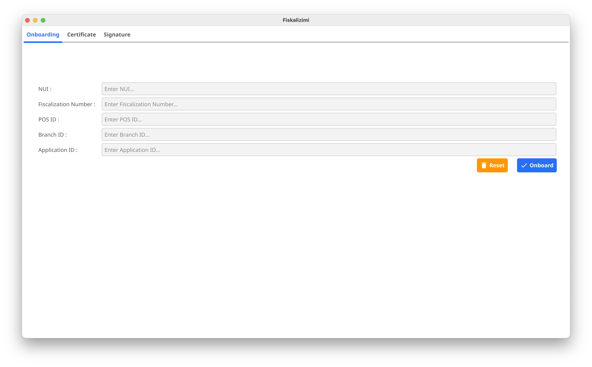
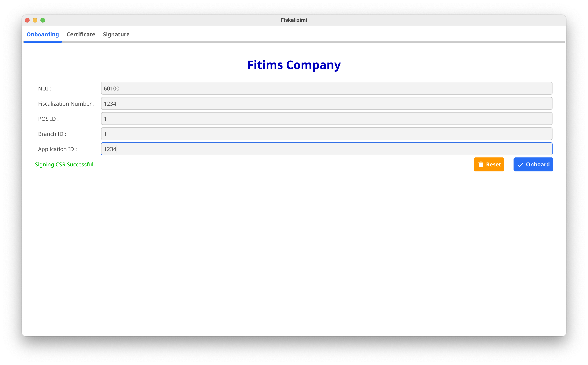
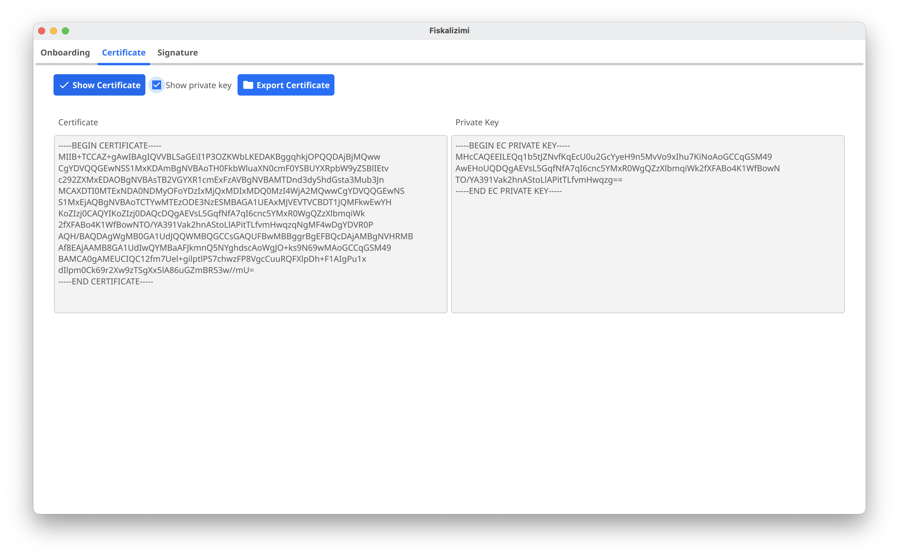
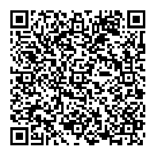

# Fiscalization Integration with C# using Protobuf

This repository provides a C# implementation for integrating with a fiscalization system using classes generated by Protobuf. The process includes constructing fiscal receipts (Citizen and POS Coupons), digitally signing them, and submitting them to the fiscalization service. This guide walks you through the steps necessary to integrate and execute the solution.

## Table of Contents

- [Project Overview](#project-overview)
- [Getting Started](#getting-started)
    - [Prerequisites](#prerequisites)
    - [Installation](#installation)
    - [Swagger Documentation](#swagger-documentation)
- [Generating Protobuf models](#generating-protobuf-models)
    - [Manually Generating Models](#manually-generating-models)
    - [Let .NET Generate Models Automatically](#let-net-generate-models-automatically)
- [Model Explanation](#model-explanation)
    - [Citizen Coupon](#citizen-coupon)
    - [POS Coupon](#pos-coupon)
- [PKI Key Generation](#pki-key-generation)
    - [Using the Onboarding Tool](#using-the-onboarding-tool)
    - [Using the API](#using-the-api)
- [Digital Signing](#digital-signing)
    - [Steps to Generate a Digital Signature](#steps-to-generate-a-digital-signature)
    - [Using the Provided DLL to Digitally Sign Strings](#using-the-provided-dll-to-digitally-sign-strings)
    - [QR Code generation](#qr-code)
- [Sending Data to the Fiscalization Service](#sending-data-to-the-fiscalization-service)
    - [Sending Citizen Coupons](#sending-citizen-coupons)
    - [Sending POS Coupons](#sending-pos-coupons)
- [Running the Application](#running-the-application)


## Project Overview

This project provides a set of C# classes to interact with a fiscalization system. The key components include:

1. **Models**: Classes generated from Protobuf definitions.
2. **ModelBuilder**: Constructs Citizen and POS coupons (receipts) using predefined tax groups, items, and payment methods.
3. **Signer**: Signs the receipts using a digital signature created with an ECDSA private key.
4. **Fiskalizimi**: Contains methods for constructing, signing, and sending fiscal coupons to the fiscalization service.

### Key Technologies
- **Protobuf**: Used for serializing the data models (CitizenCoupon, PosCoupon) to binary.
- **ECDSA**: Elliptic curve algorithm used for digital signatures.
- **HttpClient**: For sending data to the fiscalization service.

## Important Notes

Provide all item prices as integers, where the final four digits represent ten-thousandths of a euro (€0.0001).
Values should be stored as integers in €0.0001 units (e.g. €1.00 = 10000).

Examples:

| Literal Value | Integer Representation |
|--------------:|-----------------------:|
|         €1.00 |                  10000 |
|         €0.01 |                    100 |
|      €12.3456 |                 123456 |
|       €0.0001 |                      1 |


Provide all total values as integers, where the final two digits represent cents (€0.01).
Values should be stored as integers in €0.01 units (e.g. €1.00 = 100).

Examples:

| Literal Value | Integer Representation |
|--------------:|-----------------------:|
|         €1.00 |                    100 |
|         €0.01 |                      1 |
|        €12.34 |                   1234 |

## Getting Started

### Prerequisites

Before integrating the system, ensure you have the following installed:

- [.NET SDK](https://dotnet.microsoft.com/download)
- [Protobuf Compiler](https://developers.google.com/protocol-buffers)
- A valid [ECDSA private key](#key-generation) for signing the data.

### Installation

1. Clone this repository:
   ```bash
   git clone https://github.com/fiskalizimi/pos-csharp.git
   cd pos-csharp
   ```
### Swagger Documentation

The Swagger documentation is located at [Swagger](https://fiskalizimi-test.atk-ks.org/swagger/index.html)

## Generating Protobuf Models

### Manually Generating Models

To manually generate C# classes from a `.proto` file using `protoc`, the Protobuf compiler, you will first need to have the Protobuf tools installed on your system. The `protoc` compiler is responsible for compiling `.proto` files into language-specific classes, including C#. Follow these steps to generate C# classes manually:

1. **Install the Protobuf compiler:** If you don't have `protoc` installed, download and install it from the [official Protobuf releases](https://github.com/protocolbuffers/protobuf/releases). Ensure the executable is in your system's PATH.
2. **Download the C# plugin:** You need to download the Protobuf C# plugin if it's not bundled with `protoc`. It can be found in the official releases or by installing the ```Grpc.Tools``` package in a .NET project.
3. **Run the protoc command:** Use the following command in your terminal to generate the C# classes from the `models.proto` file. Replace paths accordingly for your setup:
   ```
   protoc --proto_path=./path/to/protos --csharp_out=./path/to/output ./path/to/protos/models.proto
   ```
    * `--proto_path=./path/to/protos` : Specifies the directory where your `.proto` files are located.
    * `--csharp_out=./path/to/output` : Specifies the directory where the generated C# files should be saved.
    * `models.proto` : The `.proto` file you are compiling.
4. **Generated C# classes:** After running the `protoc` command, it will generate C# classes corresponding to the Protobuf messages and enums defined in the `models.proto` file. The classes will contain methods like `ParseFrom()`, `ToByteArray()`, and properties representing each field in the messages.
5. **Include the generated classes in your project:** After generating the C# files, you can manually add them to your .NET project by copying them into your solution’s directory or directly referencing them in your project’s code.

### Let .NET Generate Models Automatically

To generate Protobuf models in .NET 8.0 from the `models.proto` file, you'll first need to install the **Google.Protobuf** package and the **Grpc.Tools** package, which provides the necessary tooling to compile `.proto` files into C# classes. This process leverages the Protobuf compiler (protoc),
which takes the `.proto` definition and generates C# model classes for use in your .NET project.

Here are the steps to generate Protobuf models:

1. **Install the required NuGet packages:**

    * Install Google.Protobuf to use Protobuf runtime classes.
    * Install Grpc.Tools to compile .proto files.

   Run the following command in your project:

    ```
    dotnet add package Google.Protobuf
    dotnet add package Grpc.Tools
    ```

2. **Add the .proto file to your project:** Place your `.proto` file (in our case `models.proto`) inside your project directory, usually in a ```Protos``` folder for organization. In the ```.csproj``` file, reference the `.proto` file to instruct the compiler to generate the necessary C# classes.
3. **Modify your .csproj file** to include Protobuf file generation instructions:
   ```
   <ItemGroup>
       <Protobuf Include="Protos/models.proto" GrpcServices="None" />
   </ItemGroup>
   ```
   Setting `GrpcServices="None"` ensures that only data models are generated, without gRPC service code, since we are only interested in the models (e.g., `PosCoupon`, `CitizenCoupon`, `Payment`, etc.).
4. **Build the project:** Run the following command to compile the `.proto` file and generate the C# classes:
   ```
   dotnet build
   ``` 
   This will automatically generate C# classes that correspond to the Protobuf messages (like `PosCoupon`, `CitizenCoupon`, `CouponItem`, etc.) in your `.proto` file.

## Model Explanation

### Citizen Coupon

The `CitizenCoupon` represents a simplified receipt that forms part of the QR code. Below is an example structure created by the [`ModelBuilder` class](fiskalizimi/ModelBuilder.cs):

>[!WARNING]
>**NOTE:** These numbers are for representation purposes only. They do not show how to calculate tax. For the correct tax calculation method, consult the official documentation at [ATK site](https://www.atk-ks.org/udhezues-manuale-dhe-rregullore/)

```
public CitizenCoupon GetCitizenCoupon()
{
    var citizenCoupon = new CitizenCoupon
    {
        BusinessId = 1,
        PosId = 1,
        BranchId = 1,
        CouponId = 1234,
        Type = CouponType.Sale,
        Time = new DateTimeOffset(2024, 10, 1, 15,30, 20, TimeSpan.Zero).ToUnixTimeSeconds(),
        Total = 1820,
        {
            new TaxGroup { TaxRate = "C", TotalForTax = 450, TotalTax = 0 },
            new TaxGroup { TaxRate = "D", TotalForTax = 296, TotalTax = 24 },
            new TaxGroup { TaxRate = "E", TotalForTax = 889, TotalTax = 161 }
        },
        TotalTax = 185,
        TotalNoTax = 1635
    };					

    return citizenCoupon;
}
```
**NOTE:** Please check [Important Notes](#important-notes) to understand how monetary values are represented.

The Citizen Coupon includes:

* **BusinessId** which is the business NUI (received from ATK)
* **PosId** is the unique ID of the POS. POS is the computer/till that has the POS system installed. Each POS unit must have a unique ID within the branch.
* **BranchId** is the unique ID of Branch where the POS system is located
* **CouponId** is the unique IDentifier of the fiscal coupon generated by the POS system. CouponId must be unique for the whole Business (across all branches)
* **Type** this is the type of the coupon. It is an enum value and can be:
    * ```SALE``` (numeric value of 1) - represents a sale
    * ```RETURN``` (numeric value of 2) - represents returned items. When the coupon type is ```SALE``` the **ReferenceNo** must be the **CouponId** of the original sale
    * ```CANCEL``` (numeric value of 3) - represents a cancelled coupon. When the coupon type is ```CANCEL``` the **ReferenceNo** must be the **CouponId** of the original sale
* **Time** the time the fiscal coupon is issued. The value is Unix timestamp
* **Total** represents the total amount to be paid by the customer
* **TaxGroups** is an array of ```TaxGroup``` objects. Each ```TaxGroup``` object represents the details about tax category and has the following details:
    * **TaxRate** - is the Tax Rate (a single letter) and can be as follows:
        * "A" exempt from VAT Percentage = 0%
        * "C" for VAT Percentage = 0%
        * "D" for VAT Percentage = 8%
        * "E" for VAT Percentage = 18%
    * **TotalForTax** - is the total amount of all items that fall under this Tax Rate
    * **TotalTax** is the total amount of Tax to be paid for this rate
* **TotalTax** is the total tax amount the customer must pay
* **TotalNoTax** is the total amount excluding tax

>[!WARNING]
>**NOTE:** These details must match the [POS Coupon](#pos-coupon) details, otherwise the coupon will be marked as ```FAILED VERIFICATION``` !
>
>**NOTE:** If the **ReferenceNo** is missing when the coupon type is ```RETURN``` or ```CANCEL``` the coupon will be rejected!


### POS Coupon

The PosCoupon includes all details of the POS Coupon that will be printed and given to the customer located in [`ModelBuilder` class](fiskalizimi/ModelBuilder.cs)

>[!WARNING]
>**NOTE:** These numbers are for representation purposes only. They do not show how to calculate tax. For the correct tax calculation method, consult the official documentation at [ATK site](https://www.atk-ks.org/udhezues-manuale-dhe-rregullore/)

```
public PosCoupon GetPosCoupon()
{
    var posCoupon = new PosCoupon
    {
        BusinessId = 60100,
        CouponId = 10,
        BranchId = 1,
        Location = "Prishtine",
        OperatorId = "Kushtrimi",
        PosId = 1,
        ApplicationId = 1234,
        ReferenceNo = 0,
        VerificationNo = "1234567890123456",
        Type = CouponType.Sale,
        Time = new DateTimeOffset(2024, 10, 1, 15,30, 20, TimeSpan.Zero).ToUnixTimeSeconds(),
        Items =
        {
            new CouponItem { Name = "uje rugove", Price = 15000, Unit = "cope", Quantity = 3, Total = 45000, TaxRate = "C", Type = "TT" },
            new CouponItem { Name = "sendviq", Price = 30000, Unit = "cope", Quantity = 2, Total = 60000, TaxRate = "E", Type = "TT" },
            new CouponItem { Name = "buke", Price = 8000, Unit = "cope", Quantity = 4, Total = 32000, TaxRate = "D", Type = "TT" },
            new CouponItem { Name = "machiato e madhe", Unit = "cope", Price = 15000, Quantity = 3, Total = 45000, TaxRate = "E", Type = "TT" }
        },
        Payments =
        {
            new Payment { Type = PaymentType.Cash, Amount = 500 },
            new Payment { Type = PaymentType.CreditCard, Amount = 1000 },
            new Payment { Type = PaymentType.Voucher, Amount = 320 }
        },
        Total = 1820,
        TaxGroups =
        {
            new TaxGroup { TaxRate = "C", TotalForTax = 450, TotalTax = 0 },
            new TaxGroup { TaxRate = "D", TotalForTax = 296, TotalTax = 24 },
            new TaxGroup { TaxRate = "E", TotalForTax = 889, TotalTax = 161 }
        },
        TotalTax = 185,
        TotalNoTax = 1635,
        TotalDiscount = 0,
    };

    return posCoupon;
}

```
**NOTE:** Please check [Important Notes](#important-notes) to understand how monetary values are represented.

The POS Coupon includes:

* **BusinessId** which is the business NUI (received from ATK)
* **PosId** is the unique ID of the POS. POS is the computer/till that has the POS system installed. Each POS unit must have a unique ID within the branch.
* **CouponId** is the unique IDentifier of the fiscal coupon generated by the POS system. CouponId must be unique for the whole Business (across all branches)
* **BranchId** is the unique ID of Branch where the POS system is located
* **Location** is the location/city of the Sale Point
* **OperatorId** is the ID/Name of the operator/server
* **ApplicationId** is the unique ID of the Application/POS System used. This code is provided by the Software provider that has implemented the POS Solution.
* **ReferenceNo** is the number of the original coupon when there is a return or cancellation of a coupon. Otherwise the field is value should be 0.
* **VerificationNo** is a unique value for each coupon, and it is 16 characters long max. Verification Number is used to check if the Coupon has been verified by the citizen.
* **Type** this is the type of the coupon. It is an enum value and can be:
    * ```SALE``` (numeric value of 1) - represents a sale
    * ```RETURN``` (numeric value of 2) - represents returned items. When the coupon type is ```SALE``` the **ReferenceNo** must be the **CouponId** of the original sale
    * ```CANCEL``` (numeric value of 3) - represents a cancelled coupon. When the coupon type is ```CANCEL``` the **ReferenceNo** must be the **CouponId** of the original sale
* **Time** the time the fiscal coupon is issued. The value is Unix timestamp
* **Items** is an array of `CouponItem` objects. Each `CouponItem` represents an item sold to the customer, and has the following information:
    * **Name** - is the name of the article
    * **Price** - is the unit price for the article (the value is in cents)
    * **Unit** - is the measurement unit of the article
    * **Quantity** - is the quantity sold
    * **Total** - is the total price (the value is in cents)
    * **TaxRate** - is the Tax Rate (a single letter) and can be as follows:
        * "A" exempt from VAT Percentage = 0%
        * "C" for VAT Percentage = 0%
        * "D" for VAT Percentage = 8%
        * "E" for VAT Percentage = 18%
    * **Type** - is the category/type of the article
* **Payments** is an array of `Payment` object that represent the types of the payment methods and the amount used by customer to pay for the goods, which means that a coupon can be paid by more than one type. It has the following information:
    * **PaymentType** - is an enum and can be
        * ```Cash``` (numeric value of 1),
        * ```CreditCard``` (numeric value of 2),
        * ```Voucher``` (numeric value of 3),
        * ```Cheque``` (numeric value of 4),
        * ```CryptoCurrency``` (numeric value of 5),
        * ```Other``` (numeric value of 6)
* **Total** represents the total amount to be paid by the customer
* **TaxGroups** is an array of ```TaxGroup``` objects. Each ```TaxGroup``` object represents the details about tax category and has the following details:
    * **TaxRate** - is the Tax Rate (a single letter) and can be as follows:
        * "A" exempt from VAT Percentage = 0%
        * "C" for VAT Percentage = 0%
        * "D" for VAT Percentage = 8%
        * "E" for VAT Percentage = 18%
    * **TotalForTax** - is the total amount of all items that fall under this Tax Rate
    * **TotalTax** is the total amount of Tax to be paid for this rate
* **TotalTax** is the total tax amount the customer must pay
* **TotalNoTax** is the total amount excluding tax
* **TotalDiscount** is the total amount of discount the customer received for this transaction

After receiving the POS coupon, the Fiscalization Service will return a unique uint64 value called ```TransactionNo```. The response will be JSON:

```
{
    "message" : "string"    // The message
    "transaction_id": 123456789  // The unique transaction ID for this coupon
}
```

If something goes wrong, you will receive a response (400 Bad Request or 500 Internal Server Error) in a JSON like below:

```
{
  "error": "details and signature don't match"
}
```

>[!WARNING]
>**NOTE:** These details must match the [Citizen Coupon](#citizen-coupon) details, otherwise the coupon will be marked as ```FAILED VERIFICATION``` !
>
>**NOTE:** If the **ReferenceNo** is missing when the coupon type is ```RETURN``` or ```CANCEL``` the coupon will be rejected!

## PKI Key Generation

There are different ways to generate a PKI key pair, depending on the operating system.

>[!WARNING]
>**WARNING!** Each POS system (PC/till) must have a unique ID and its own PKI key pair. The private key must never leave the machine on which it was generated !!!

To onboard your business, you need the following information:

1. NUI of the business
2. Fiscalization Number - (this is obtained from EDI)
3. Pos ID - each POS should have a unique ID which is a numeric value
4. Branch ID - is the unique ID of Branch where the POS system is located
5. Application ID - obtained from the ATK upon certifying the POS Application

### Using the Onboarding Tool

A provided onboarding tool simplifies the process by creating the key pair, generating a CSR and sending the CSR to ATK Certificate Authority to be digitally signed and verified.

If you have cloned this repository the tool for different operating systems is located under the folder ```onboarding``` or, alternatively to download the tool to your machine, click on one of the links below (depending on the operating system you are using):

* [onboarder for windows](https://github.com/fiskalizimi/pos-golang/raw/refs/heads/main/onboarder/onboarder-windows.zip)
* [onboarder for MacOS](https://github.com/fiskalizimi/pos-golang/raw/refs/heads/main/onboarder/onboarder-macos.zip)
* [onboarder for Linux](https://github.com/fiskalizimi/pos-golang/raw/refs/heads/main/onboarder/onboarder-linux.zip)


After downloading and extracting the onboarder tool, run the application.
Provide an environment flag as an argument to the executable. For testing purposes the environment value should be ```TEST```, and for production the environment value should be ```PROD```

For example

On Windows you need to open a command prompt then execute the application like the example below (for test change environment to TEST):
```shell
onboarder.exe -env=PROD
```

On Linux/macOS you need to open a terminal and then execute the application like the example below (for test change environment to TEST):
```shell
./onboarder -env=PROD
```



If everything went OK, then you will get a success message:




To view certificate and private key in PEM format, on the **Certificate** tab, first tick the **Show private key** checkbox, then click on the **Show Certificate** button:



To extract certificate and private key in PEM format, on the **Certificate** tab, first tick the **Show private key** checkbox, then click on the **Export Certificate** button.
This action will create another two files in the folder ```private-key.pem``` and ```signed-certificate.pem```

### Using the API

To use the API, you need to create a new **ECDSA private key** using the **P-256 elliptic curve** using a secure random number generator. A sample code of how to generate a private key is on [Pki.cs](fiskalizimi/Pki.cs) and [Program.cs](fiskalizimi/Program.cs) classes.

The next step is to get ```VerificationCode``` from the Fiscalization Service. To get the ```VerificationCode``` a ```POST``` request needs to be sent to the ```https://fiskalizimi.atk-ks.org/ca/verify/{nui}``` (for test the url is: ```https://fiskalizimi-test.atk-ks.org/ca/verify/{nui}```) and JSON body of:

```
{
    "fiscalization_no" : "string" // The fiscalization number from EDI 
    "pos_id" : "uint64"           // The Pos ID to be registered
    "branch_id" : "uint64"        // The Branch ID where the POS is located
    "application_id" : "uint64"   // The Application ID  
}
```

The response will be JSON:

```
{
    "business_name" : "string"    // The name of the Business (to be used in CSR)
    "verification_code": "string"  // The Verification Code (to be used in CSR)
}
```


Once you have the **private key**, **business name**, and **verification code**, generate a CSR with the following information:

* **Country:** "RKS" (or "XK" if only 2 letters to be used for country)
* **Organization:** Business ID
* **Organization Unit:** Pos ID
* **Locality:** Branch ID
* **CommonName:** The name of the business

The CSR needs to be in ```.pem``` format. A sample of a CSR is below:
```
-----BEGIN CERTIFICATE REQUEST-----
MIHwMIGWAgEAMDQxDDAKBgNVBAYTA1JLUzEKMAgGA1UEChMBMTEYMBYGA1UEAxMP
Rml0aW0ncyBDb21wYW55MFkwEwYHKoZIzj0CAQYIKoZIzj0DAQcDQgAEhWoAnHs6
/2EWf2bvtHrJwQXxtap8QjJlTbI3Y/eSvmtaBWdJyhs9QsakDLYfSytcyxbYDsYT
+uuo1knlR2xL2qAAMAoGCCqGSM49BAMCA0kAMEYCIQD3XmlSMXXlCoGL1i8FvjpM
7cEFG0caI8lo6gwQvHy3jwIhAKP4m5nnbncPANmp++Z3vMFsSsua4iybjs7WYofX
tAiM
-----END CERTIFICATE REQUEST-----
```

A sample code of how to generate a CSR is on [Pki.cs](fiskalizimi/Pki.cs) and [Program.cs](fiskalizimi/Program.cs) classes.


After the CSR is generated and signed with the private key, send a POST request to the ```https://fiskalizimi.atk-ks.org/ca/signcsr``` (for test the url is: ```https://fiskalizimi-test.atk-ks.org/ca/signcsr```) endpoint with the following JSON:

```
{
    "business_name" : "string"     // name of the business
    "business_id" : "uint64"       // Business ID (which is same as NUI)
    "branch_id" : "uint64"         // Branch ID
    "verification_code": "string"  // Verification Code
    "pos_id" : "uint64"            // Pos ID
    "application_id": "uint64"     // The Application ID  
    "csr" : "string"               // CSR in .pem format
}
```

* **business_name:** is the name of the business (received during the verification step)
* **business_id:**  is the Business ID/NUI of the business to be onboarded
* **branch_id:** Branch ID is the location of the POS system
* **verification_code:** is Verification Code (received during the verification step)
* **pos_id:** Pos ID of the Pos system to be onboarded
* **application_id:** The ID of the application (obtained after the POS system has been certified by ATK)
* **csr:** This is the Certificate Signing Request in .pem format


If everything is OK, the response will include with the signed certificate:
```
{
    "signed_certificate" : "string" // Signed Certificate in .pem format
}
```

This completes the onboarding step.

>[!NOTE]
>For a complete example in C# .NET 8, a community member [Gazmend Mehmeti](https://www.linkedin.com/in/gazmendmehmeti/) has shared a repository on [GitHub](https://github.com/gmehmeti/eFiscalX.Onboarder)


>[!WARNING]
>**WARNING!** Make sure to keep the private key safe.

## Digital Signing

Before data is sent to the Fiscalization System, the POS Coupon details need to be digitally signed using the private key to ensure the authenticity and integrity of the data transmitted to the fiscalization system.

#### Why Digital Signing?

The fiscalization system requires each coupon to be signed digitally before submission to ensure:

1. **Data Integrity:** Ensures that the data sent to the fiscalization service has not been tampered with during transmission.
2. **Authentication:** Confirms that the coupon is issued by a legitimate entity (in this case, your business), preventing fraudulent submissions.
3. **Non-repudiation:** Guarantees that the sender cannot deny sending the data once it has been signed and submitted.

The digital signature is generated using a private key, and the fiscalization service verifies the signature using a corresponding public key. If the signature is valid, the coupon is considered authentic.

### Steps to Generate a Digital Signature

The steps to provide a valid signature are:

1. **Serialization:** First, the coupon (either a Citizen or POS coupon) is serialized into a Protobuf binary format. This format allows the data to be transmitted efficiently and consistently.
   ```
   byte[] posCouponProto = posCoupon.ToByteArray();
   ```
2. **Base64 Encoding:** The serialized Protobuf binary data is then encoded into a Base64 string. Base64 is a binary-to-text encoding scheme that makes it easier to transfer data as a string format.
   ```
   var base64EncodedProto = Convert.ToBase64String(posCouponProto);
   ```
3. **Hashing:** Before signing, the data is hashed using a SHA-256 cryptographic hash function. Hashing converts the coupon data into a fixed-length string of bytes, ensuring that even a small change in the original data will produce a completely different hash value.
   ```
   var sha256 = SHA256.Create();
   var hash = sha256.ComputeHash(Encoding.UTF8.GetBytes(base64EncodedProto));
   ```
4. **Signature Creation:** The hash is then signed using the ECDSA private key. This generates a digital signature, which is unique to the data and private key. The fiscalization system can later verify this signature using the corresponding public key.
   ```
   var ecdsa = ECDsa.Create();
   ecdsa.ImportFromPem(_key);  // Load the private key
   var signature = ecdsa.SignHash(hash);
   ```
5. **Base64 Signature:** The generated signature is then encoded into a Base64 string, which makes it easier to include in the final request to the fiscalization service.
   ```
   var encodedSignature = Convert.ToBase64String(signature);
   ```

The [Signer class](fiskalizimi/Signer.cs) digitally signs both Citizen and POS coupons using the **ECDSA** algorithm. A private key is loaded and used to create a signature over the serialized coupon data.

```
public string SignBytes(byte[] data)
{
    var ecdsa = ECDsa.Create();
    ecdsa.ImportFromPem(_key);
    var hash = SHA256.Create().ComputeHash(data);
    var signature = ecdsa.SignHash(hash);
    return Convert.ToBase64String(signature);
}
```

The return value is a **base64-encoded** signature.

### Using the Provided DLL to Digitally Sign Strings

We have also provided a DLL that is used to digitally sign a string and return a Base64 string of the signature. You can utilize it in a C# application using the ```DllImport```
attribute to call the external method from the DLL. The DLL exposes a function called ```DigitallySign```, which takes a message and a private key as inputs and returns a digitally signed Base64 string.

The class [```DllImporter```](fiskalizimi/DllImporter.cs) shows the interaction with provided external DLL to perform digital signing of a message which can be a Base64 string encoding of protobuf representation of
either [PosCoupon](#pos-coupon) or [CitizenCoupon](#citizen-coupon) that is used in [QR Code](#qr-code).

This is done by importing the ```DigitallySign``` function from a native DLL (named "```signer```") using the ```[DllImport]``` attribute,
which allows unmanaged functions to be called in C#. The external DLL performs the actual cryptographic operation, digitally signing the input message using a private key.

1. **Initialization:** The class is initialized with a private key, provided through the constructor and stored in the ```_key``` field. This private key, in PEM format or another appropriate format, will be used by the external DLL to sign messages.
2. **Importing the DLL Function:** The DllImport attribute is used to declare the ```DigitallySign``` method. This method is marked as ```extern```, meaning it is defined externally (in the DLL). It takes two byte arrays as parameters: the first is the message to be signed, and the second is the private key. The method returns an ```IntPtr```, which points to the memory location of the resulting digital signature.
   ```
   [DllImport("signer", EntryPoint = "DigitallySign")]
   static extern IntPtr DigitallySign(byte[] msg, byte[] key);
   ```
3. **Signing a Message:** The ```SignMessage``` method converts the input message (string) into a byte array using ```Encoding.ASCII.GetBytes()``` and does the same for the private key. These byte arrays are passed to the ```DigitallySign``` function from the DLL. The result from this call is a pointer ```(IntPtr)``` to the digital signature, which is then converted into a Base64-encoded string using ```Marshal.PtrToStringAnsi()```. The method returns this Base64 string, which is the digital signature of the input message.
   ```
   public string SignMessage(string msg)
   {
       var msgBytes = Encoding.ASCII.GetBytes(msg); // Convert message to bytes
       var result = DigitallySign(msgBytes, Encoding.ASCII.GetBytes(_key)); // Call DLL method
       var signature = Marshal.PtrToStringAnsi(result); // Convert result to string
       return signature; // Return the signature
   }
   ```


### QR Code

A printed fiscal coupon must also include a QR Code that citizens can scan to verify the authenticity of the receipt.

In the Fiscalization System, QR codes are generated based on the serialized and signed data of a Citizen Coupon. The data, once encoded into a QR code, is typically printed on the customer receipt.

#### QR Code Data Structure

In this implementation, the QR code contains:

1. The **Base64-encoded** serialized data of the [Citizen Coupon](#citizen-coupon).
2. The **Base64-encoded** digital signature of that data.

These two parts are combined into a single string, separated by a pipe | symbol, which forms the data to be encoded in the QR code.

#### QR Code Generation in Code

The following steps show how the QR code data is generated in the ```Fiskalizimi``` class using the `CitizenCoupon` model.

1. **Serialize the CitizenCoupon to Protobuf binary:** This ensures that the receipt data is in a compact binary format.
   ```
   byte[] citizenCouponProto = citizenCoupon.ToByteArray();
   ```
2. **Base64 encode the Protobuf data:** This converts the binary data into a Base64-encoded string, making it suitable for use in the QR code.
   ```
   var base64EncodedProto = Convert.ToBase64String(citizenCouponProto);
   ```
3. **Generate a digital signature:** Using the ECDSA private key, sign the Base64-encoded Protobuf data to ensure its authenticity and integrity.
   ```
   var base64EncodedBytes = Encoding.UTF8.GetBytes(base64EncodedProto);
   string signature = signer.SignBytes(base64EncodedBytes);
   ```
4. **Combine the data and signature:** The Base64-encoded coupon data and the Base64-encoded signature are concatenated with a pipe | symbol to form the final string, which will be encoded into a QR code.
   ```
   string `qrCodeString` = $"{base64EncodedProto}|{signature}";
   ```
5. **Print or display the QR code:** The resulting `qrCodeString` can now be encoded into a QR code and printed on the receipt or displayed on a screen.



Below is the method in the [Fiskalizimi class](fiskalizimi/Program.cs) that generates the QR code string for a Coupon:

```
public static string SignCitizenCoupon(CitizenCoupon citizenCoupon, ISigner signer)
{
    // Serialize the citizen coupon message to protobuf binary
    byte[] citizenCouponProto = citizenCoupon.ToByteArray();

    // convert the serialized protobuf of citizen coupon to base64 string
    var base64EncodedProto = Convert.ToBase64String(citizenCouponProto);

    // convert the base64 string of the citizen coupon to byte array
    var base64EncodedBytes = Encoding.UTF8.GetBytes(base64EncodedProto);
    
    // digitally sign the bytes and return the signature
    string signature = signer.SignBytes(base64EncodedBytes);
    
    Console.WriteLine($"Coupon   : {base64EncodedProto}");
    Console.WriteLine($"signature: {signature}");
    
    // Combine the encoded data and signature to create QR Code string and return it
    string `qrCodeString` = $"{base64EncodedProto}|{signature}";
    Console.WriteLine($"qr code  : {`qrCodeString`}");
    return `qrCodeString`;
}
```


## Sending Data to the Fiscalization Service

### Sending Citizen Coupons

>[!WARNING]
>**NOTE:** This section applies to mobile app that will be used for verifying coupons.
>It is **NOT** relevant to POS systems.


QR Code will be scanned by the Citizen mobile app, which in turn will send the data to the Fiscalization System for verification.
This method mimics the Citizen mobile app, and is used for testing. The [SendQrCode method](fiskalizimi/Program.cs) sends the serialized and signed citizen coupon to the fiscalization service.

Prepare and submit the request as follows:

```
public static async Task SendQrCode()
{
    var builder = new ModelBuilder();
    var signer = new Signer(PrivateKeyPem);
    var citizenCoupon = builder.GetCitizenCoupon();
    var qrCode = SignCitizenCoupon(citizenCoupon, signer);

    var request = new { citizen_id = 1, qr_code = qrCode };
    var response = await new HttpClient().PostAsJsonAsync(url, request);
    response.EnsureSuccessStatusCode();
}
```


The JSON request should look like:

```
{
  "citizen_id": 7872345678,
  "qr_code":"CIHI0p4CENIJGAEgATABOJy/w64GQJwOSgYKAUMQwgNKCAoBRBDAAhgaSgkKAUUQmggYvQFQ1wE=|MEUCIA0Cg2dC+JkPyxkpUDY9VPE6+WCJDOPFkpcyNHbQ0MxTAiEAhn4kdIebWarW2zvRz2k2dLZf29MxzG+4RFeY1g/C95k="
}
```

### Sending POS Coupons

Similar to citizen coupons, you can send POS coupons with the [SendPosCoupon method](fiskalizimi/Program.cs):

```
public static async Task SendPosCoupon()
{
    var builder = new ModelBuilder();
    var signer = new Signer(PrivateKeyPem);
    var posCoupon = builder.GetPosCoupon();
    var (coupon, signature) = SignPosCoupon(posCoupon, signer);

    var request = new { details = coupon, signature = signature };
    var response = await new HttpClient().PostAsJsonAsync(url, request);
    response.EnsureSuccessStatusCode();
}
```

The JSON request should look like:

```
{
  "details":"CIHI0p4CENIJGAEiCVByaXNodGluZSoJS3VzaHRyaW1pMAE4wMQHQhAxMjM0NTY3ODkwMTIzNDU2SAFQnL/DrgZaJAoKdWplIHJ1Z292ZRCWARoEY29wZSUAAEBAKMIDMgFDOgJUVFohCgdzZW5kdmlxEKwCGgRjb3BlJQAAAEAo2AQyAUU6AlRUWh0KBGJ1a2UQUBoEY29wZSUAAIBAKMACMgFEOgJUVFoqChBtYWNoaWF0byBlIG1hZGhlEJYBGgRjb3BlJQAAQEAowgMyAUU6AlRUYgUIARD0A2IFCAIQ6AdiBQgDEMACaJwOcgYKAUMQwgNyCAoBRBDAAhgacgkKAUUQmggYvQF41wGAAcUM",
  "signature":"MEQCIA5bgcs5gqxIAoKujhK7LXobNqa130DCjUTdBrCctYV1AiAzkvoSi+mvzFL4ThvzYPVsKegJ5sL00msyrlEiEJ6NmA=="
}
```

## Running the Application

Before running the sample application, you must complete onboarding.
Once you have been [onboarded](#pki-key-generation), copy the private key and replace
the placeholder private key in the [Program.cs](fiskalizimi/Program.cs) file

To execute the program and send the coupons, run:
```
dotnet run
```

>[!NOTE]
>Configure the correct URL of the fiscalization service and have a valid ECDSA private key to sign the coupons.

